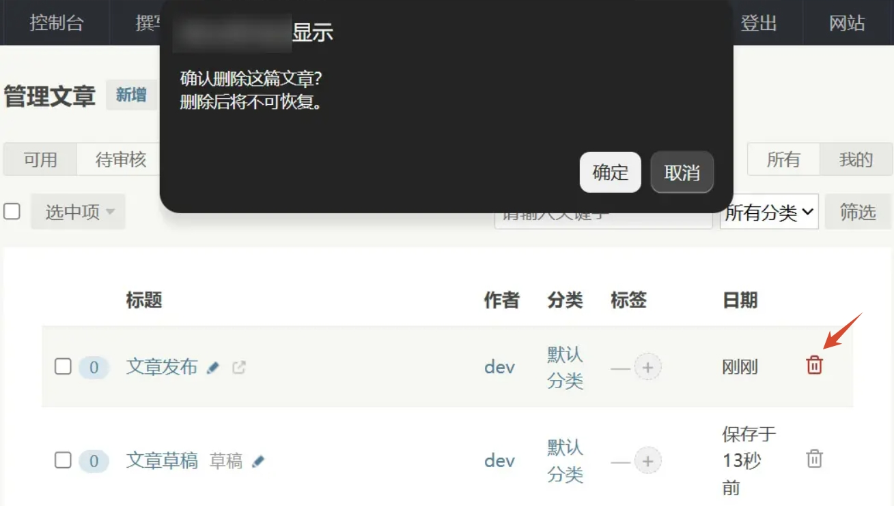

# QuickDelete-Typecho-Plugin
Typecho文章快捷删除 + 自定义字段样式

适配Typecho 1.3.0 + PHP 8.4，其他版本未测试，请在测试环境确认正常使用后再上线使用，注意备份以防不测。

文章管理页面右端增加一个删除按钮

文章编辑页面底部新增一个删除按钮

文章编辑页面自定义字段输入框长度设置

本插件由AI大模型： [智谱清言][1]、[DeepSeek][2]、 [豆包][3] 编写

 [1]:https://chatglm.cn/
 [2]:https://www.deepseek.com/
 [3]:https://www.doubao.com/
